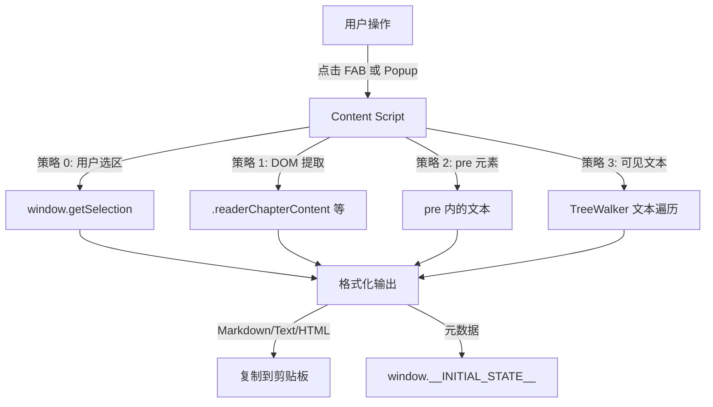

# Weread Extract - 微信读书内容提取 Chrome 插件

## 概述

Chrome Manifest V3 插件，一键提取微信读书 (weread.qq.com) 章节内容，支持 Markdown/纯文本/HTML 格式输出，方便交给 AI 分析、提炼和写作。

## 架构



## 项目结构

```
manifest.json          # MV3 配置
src/
  background/          # Service Worker
  content/             # 内容脚本 + 提取器 + 样式
  popup/               # 弹出面板 UI
  icons/               # 插件图标
```

## 技术要点

- **多策略提取**: 用户选区 → DOM → pre 元素 → 可见文本，自动降级
- **Canvas 模式检测**: 检测 Canvas 渲染模式并提示用户切换
- **Page Context 注入**: 通过 script 注入访问 `window.__INITIAL_STATE__`
- **深色 UI**: Catppuccin Mocha 配色，与微信读书深色模式协调

## 加载测试

1. Chrome → `chrome://extensions/`
2. 开启「开发者模式」
3. 「加载已解压的扩展程序」→ 选择本项目根目录
4. 打开 weread.qq.com 阅读页，右下角出现紫色 FAB 按钮

## 快捷键

- `Alt+W` 打开/关闭页面内提取面板
- `Esc` 关闭面板
