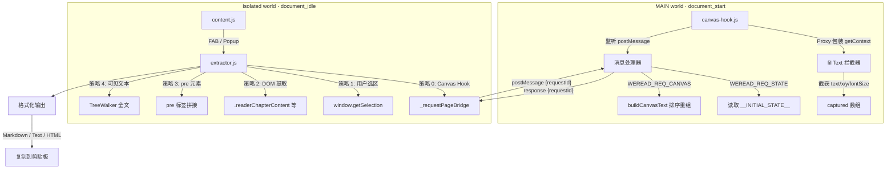

# Weread Extract - 微信读书内容提取 Chrome 插件

## 概述

Chrome Manifest V3 插件，一键提取微信读书 (weread.qq.com) 章节内容，支持 Markdown/纯文本/HTML 格式输出，方便交给 AI 分析、提炼和写作。

核心思路参考 [drunkdream/weread-exporter](https://github.com/drunkdream/weread-exporter)：在文字变成像素之前，Hook Canvas `fillText()` 截获绘制参数。

## 架构



## 核心原理

微信读书通过 Canvas `fillText()` 渲染书籍正文，DOM 中不存在可读文本。

1. **`manifest.json` 配置 `world: "MAIN"`**，让 `canvas-hook.js` 在页面上下文中直接运行，绕过 CSP 对 inline script 的限制
2. `document_start` 阶段安装 Proxy Hook，拦截 `HTMLCanvasElement.getContext('2d')`
3. Proxy 包装 `CanvasRenderingContext2D`，截获每次 `fillText(text, x, y)` 调用
4. 捕获文本、坐标、字号到 `captured[]` 数组，按 Y/X 坐标排序重组为阅读顺序
5. `WeakMap` 缓存 Proxy 实例，防止同一 context 被重复包装
6. 通过 `window.postMessage` + `requestId` 路由实现 MAIN world 与 Isolated world 双向通信

### 文本重组规则

| 参数 | 阈值 | 含义 |
|------|------|------|
| Y 坐标差 < 3px | 同一行 | 按 X 排序拼接 |
| Y 坐标差 > 35px | 段落分隔 | 插入空行 |
| fontSize >= 27px | H2 标题 | `## ` 前缀 |
| fontSize >= 23px | H3 标题 | `### ` 前缀 |
| 文本以 `abcdefghijklmn` 开头 | 反爬水印 | 过滤丢弃 |

### 通信桥接

```
Isolated world (extractor.js)          MAIN world (canvas-hook.js)
        |                                      |
        |-- postMessage({                      |
        |     type: 'WEREAD_REQ_CANVAS',       |
        |     requestId: 'weread-xxx'          |
        |   }) -------->                       |
        |                                      |--> buildCanvasText()
        |                                      |
        |                     <-- postMessage({ |
        |     type: 'WEREAD_CANVAS_DATA',      |
        |     requestId: 'weread-xxx',          |
        |     text: '...'                       |
        |   })                                  |
```

`_requestPageBridge(requestType, responseType, timeout)` 封装了完整的请求-响应-超时逻辑。

## 项目结构

```
manifest.json                # MV3 配置，双 content_scripts 入口
src/
  background/
    service-worker.js        # Service Worker，消息中转
  content/
    canvas-hook.js           # Canvas Proxy Hook (MAIN world, document_start)
    extractor.js             # 多策略提取核心 (Isolated world)
    content.js               # FAB 面板 + 事件处理 + Popup 通信
    content.css              # 深色主题样式 (Catppuccin Mocha)
  popup/
    popup.html               # 弹出面板
    popup.js                 # 弹出面板逻辑
    popup.css                # 弹出面板样式
  icons/
    icon16/48/128.png        # 插件图标
    generate-icons.html      # 图标生成辅助页
tests/
  content/
    test_csp_inline_script.py  # CSP 限制验证测试
diss/
  csp-inline-script/
    analysis.md              # CSP 问题分析文档
AGENTS.md                    # Agent 协作配置
```

## 提取策略优先级

### extractChapter（章节提取）

| 优先级 | 策略 | 说明 |
|--------|------|------|
| 0 | Canvas Hook | 拦截 fillText，最可靠 |
| 1 | 用户选区 | `window.getSelection()` |
| 2 | DOM 提取 | `.readerChapterContent` 等选择器 |
| 3 | pre 元素 | 阅读容器内 pre 标签拼接 |
| 4 | 可见文本 | TreeWalker 遍历文本节点 |

### extractVisible（可见内容提取）

| 优先级 | 策略 | 说明 |
|--------|------|------|
| 1 | 用户选区 | 优先使用手动选中 |
| 2 | Canvas Hook | 无选区时使用 |
| 3 | 可见文本 | 最终兜底 |

## 加载测试

1. Chrome -> `chrome://extensions/`
2. 开启「开发者模式」
3. 「加载已解压的扩展程序」-> 选择本项目根目录
4. 打开 weread.qq.com 阅读页，右下角出现紫色 FAB 按钮

## 快捷键

- `Alt+W` 打开/关闭页面内提取面板
- `Esc` 关闭面板
