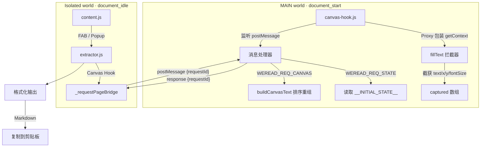

# Weread Extract - 微信读书内容提取 Chrome 插件

## 概述

Chrome Manifest V3 插件，一键提取微信读书 (weread.qq.com) 章节内容，支持 Markdown 格式输出，方便交给 AI 分析、提炼和写作。

核心思路参考 [drunkdream/weread-exporter](https://github.com/drunkdream/weread-exporter)：在文字变成像素之前，Hook Canvas `fillText()` 截获绘制参数。

## 架构



## 核心原理

微信读书通过 Canvas `fillText()` 渲染书籍正文，DOM 中不存在可读文本。

1. **`manifest.json` 配置 `world: "MAIN"`**，让 `canvas-hook.js` 在页面上下文中直接运行，绕过 CSP 对 inline script 的限制
2. `document_start` 阶段安装 Proxy Hook，拦截 `HTMLCanvasElement.getContext('2d')`
3. Proxy 包装 `CanvasRenderingContext2D`，截获每次 `fillText(text, x, y)` 调用
4. 捕获文本、坐标、字号到 `captured[]` 数组，按 Y/X 坐标排序重组为阅读顺序
5. `WeakMap` 缓存 Proxy 实例，防止同一 context 被重复包装
6. 通过 `window.postMessage` + `requestId` 路由实现 MAIN world 与 Isolated world 双向通信
7. 同时监听 `font` 属性 setter，追踪当前字号用于标题识别

### 文本重组规则

| 参数 | 阈值 | 含义 |
|------|------|------|
| Y 坐标差 < 3px | 同一行 | 按 X 排序拼接 |
| Y 坐标差 > 35px | 段落分隔 | 插入空行 |
| fontSize >= 27px | H2 标题 | `## ` 前缀 |
| fontSize >= 23px | H3 标题 | `### ` 前缀 |
| 文本以 `abcdefghijklmn` 开头 | 反爬水印 | 过滤丢弃 |

### 通信桥接

```
Isolated world (extractor.js)          MAIN world (canvas-hook.js)
        |                                      |
        |-- postMessage({                      |
        |     type: 'WEREAD_REQ_CANVAS',       |
        |     requestId: 'weread-xxx'          |
        |   }) -------->                       |
        |                                      |--> buildCanvasText()
        |                                      |
        |                     <-- postMessage({ |
        |     type: 'WEREAD_CANVAS_DATA',      |
        |     requestId: 'weread-xxx',          |
        |     text: '...'                       |
        |   })                                  |
```

`_requestPageBridge(requestType, responseType, timeout)` 封装了完整的请求-响应-超时逻辑。

## 项目结构

```
manifest.json                # MV3 配置，双 content_scripts 入口
src/
  background/
    service-worker.js        # Service Worker，消息中转
  content/
    canvas-hook.js           # Canvas Proxy Hook (MAIN world, document_start)
    extractor.js             # 提取核心 (Isolated world) — Canvas Hook + Markdown 格式化
    content.js               # FAB 按钮 + 一键提取 + Popup 通信
    content.css              # 浅色主题样式
  popup/
    popup.html               # 弹出面板
    popup.js                 # 弹出面板逻辑
    popup.css                # 弹出面板样式
  icons/
    icon16/48/128.png        # 插件图标
tests/
  content/
    test_csp_inline_script.py  # CSP 限制验证测试
```

## 使用方式

| 操作 | 效果 |
|------|------|
| 点击右下角按钮 | 一键提取当前可见内容并复制到剪贴板 |
| 点击工具栏插件图标 | 打开 Popup 面板，可预览后再复制 |
| Esc | 关闭面板（如果打开） |

## 加载测试

1. Chrome -> `chrome://extensions/`
2. 开启「开发者模式」
3. 「加载已解压的扩展程序」-> 选择本项目根目录
4. 打开 weread.qq.com 阅读页，右下角出现蓝色 FAB 按钮
5. 点击按钮即可提取内容
