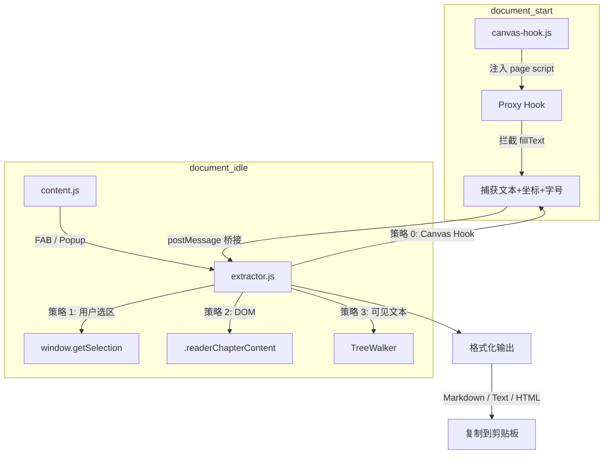

# Weread Extract - 微信读书内容提取 Chrome 插件

## 概述

Chrome Manifest V3 插件，一键提取微信读书 (weread.qq.com) 章节内容，支持 Markdown/纯文本/HTML 格式输出，方便交给 AI 分析、提炼和写作。

## 架构



## 核心原理

微信读书通过 Canvas `fillText()` 渲染书籍正文，DOM 中不存在可读文本。本插件通过以下方式提取：

1. **`document_start`** 阶段注入 Proxy Hook，拦截 `HTMLCanvasElement.getContext('2d')`
2. Proxy 包装 CanvasRenderingContext2D，截获每次 `fillText(text, x, y)` 调用
3. 捕获文本、坐标、字号，按 Y/X 坐标排序重组为阅读顺序
4. 通过 `window.postMessage` 桥接 page context 与 content script

## 项目结构

```
manifest.json            # MV3 配置
src/
  background/            # Service Worker
  content/
    canvas-hook.js       # Canvas Proxy Hook (document_start)
    extractor.js         # 多策略提取核心
    content.js           # FAB 面板 + 事件处理
    content.css          # 深色主题样式
  popup/                 # 弹出面板 UI
  icons/                 # 插件图标
```

## 加载测试

1. Chrome → `chrome://extensions/`
2. 开启「开发者模式」
3. 「加载已解压的扩展程序」→ 选择本项目根目录
4. 打开 weread.qq.com 阅读页，右下角出现紫色 FAB 按钮

## 快捷键

- `Alt+W` 打开/关闭页面内提取面板
- `Esc` 关闭面板
