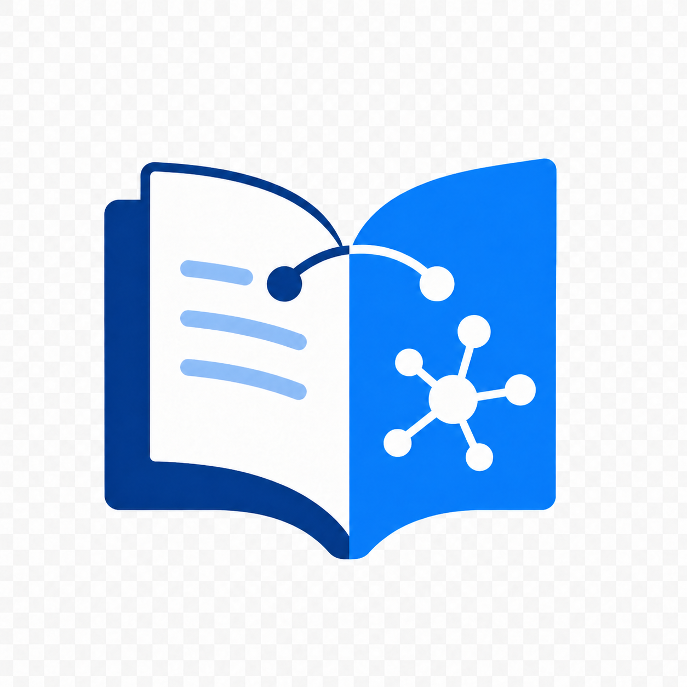

<div align="center">

# Weread Extract

<p align="center">
  
</p>

> *「不光读完，还要读懂」*

[](LICENSE)
[](https://developer.chrome.com/docs/extensions/mv3/)
[](https://github.com/Harryleft/wechatread-content-extractor-plugin/pulls)

<br>

**一键提取章节内容，交给 AI 理解**

<br>

[效果演示](#效果演示) · [安装](#安装) · [使用](#使用) · [核心原理](#核心原理) · [项目结构](#项目结构)

<br>

</div>

---

## 效果演示

**一键操作，一步到位。**

点击右下角蓝色按钮 → 自动提取 + 复制 → 粘贴到 AI 对话窗口。

提取出的内容自动格式化为 Markdown：

```markdown
## 第三章 认知驱动

真正的成长不是积累知识，而是改变认知框架...

### 认知框架的本质

认知框架是我们理解世界的方式。它不是静态的...
```

在微信读书阅读页右下角点击按钮，整章内容即刻到手。

---

## 安装

### 开发者模式加载

1. 克隆仓库
   ```bash
   git clone https://github.com/Harryleft/wechatread-content-extractor-plugin.git
   ```

2. 打开 Chrome，地址栏输入 `chrome://extensions/`

3. 开启右上角「**开发者模式**」

4. 点击「**加载已解压的扩展程序**」→ 选择本项目根目录

5. 打开 [weread.qq.com](https://weread.qq.com) 任意书籍阅读页，右下角出现蓝色按钮即安装成功

---

## 使用

| 操作 | 效果 |
|------|------|
| 点击右下角蓝色按钮 | 一键提取当前可见内容并复制到剪贴板 |
| 点击工具栏插件图标 | 打开 Popup 面板，可预览后再复制 |

复制后直接粘贴到 ChatGPT、Claude、DeepSeek 等 AI 工具中进行分析。

---

## 核心原理

微信读书通过 Canvas `fillText()` 渲染书籍正文，**DOM 中不存在可读文本**。

Weread Extract 在 `document_start` 阶段安装 Proxy Hook，拦截 `HTMLCanvasElement.getContext('2d')`，截获每次 `fillText(text, x, y)` 调用，将捕获的文本按坐标排序重组为阅读顺序。

```
微信读书 Canvas 渲染 → Proxy 拦截 fillText() → 捕获文本+坐标+字号
→ 按 Y/X 排序重组 → Markdown 格式化 → 复制到剪贴板
```

核心思路参考 [drunkdream/weread-exporter](https://github.com/drunkdream/weread-exporter)。

### 文本重组规则

| 参数 | 阈值 | 含义 |
|------|------|------|
| Y 坐标差 < 3px | 同一行 | 按 X 排序拼接 |
| Y 坐标差 > 35px | 段落分隔 | 插入空行 |
| fontSize ≥ 27px | 章节标题 | `## ` 前缀 |
| fontSize ≥ 23px | 小节标题 | `### ` 前缀 |
| 文本以 `abcdefghijklmn` 开头 | 反爬水印 | 过滤丢弃 |

### 提取方式

微信读书正文完全通过 Canvas 渲染，Weread Extract 通过拦截 `fillText()` 调用来获取文本。这是唯一可行的方案——DOM 中不存在书籍文本，无需多策略降级。

---

## 项目结构

```
wechatread-content-extractor-plugin/
├── manifest.json                # MV3 配置，双 content_scripts 入口
├── logo/
│   └── logo.png                 # 插件图标源文件
├── src/
│   ├── background/
│   │   └── service-worker.js    # Service Worker，消息中转
│   ├── content/
│   │   ├── canvas-hook.js       # Canvas Proxy Hook (MAIN world, document_start)
│   │   ├── extractor.js         # 提取核心 (Isolated world) — Canvas Hook + Markdown 格式化
│   │   ├── content.js           # FAB 按钮 + 一键提取 + Popup 通信
│   │   └── content.css          # 浅色主题样式
│   ├── popup/
│   │   ├── popup.html           # 弹出面板
│   │   ├── popup.js             # 弹出面板逻辑
│   │   └── popup.css            # 弹出面板样式
│   └── icons/
│       ├── icon16.png           # 16×16 图标
│       ├── icon48.png           # 48×48 图标
│       └── icon128.png          # 128×128 图标
├── tests/
│   └── content/
│       └── test_csp_inline_script.py  # CSP 限制验证测试
├── CLAUDE.md                    # Agent 协作配置
└── AGENTS.md                    # Agent 配置
```

---

## 技术亮点

- **Manifest V3 + `world: "MAIN"`** — 绕过微信读书 CSP 限制，直接在页面上下文注入 Hook
- **WeakMap 缓存** — 同一 Canvas Context 不会被重复 Proxy 包装
- **双向通信桥** — `postMessage` + `requestId` 路由实现 MAIN world 与 Isolated world 通信
- **坐标排序重组** — 按 Y/X 坐标将 fillText 片段还原为阅读顺序，识别段落和标题

---

## 背后的故事

我经常用微信读书看书，看到精彩内容想摘出来交给 AI 做深度分析。但微信读书的正文通过 Canvas 渲染，无法直接复制。

手动截图再 OCR？太慢。一篇篇导出？太麻烦。

后来发现 [drunkdream/weread-exporter](https://github.com/drunkdream/weread-exporter) 的思路——Hook Canvas `fillText()` 在文字渲染前截获。于是基于这个思路做了 Chrome 插件版本，一键提取、自动格式化、直接进剪贴板。

从「点击按钮 → 打开面板 → 选择提取 → 点击复制」到「点击按钮 → 完成」，让提取这件事尽可能无感。

---

## 参考

- [drunkdream/weread-exporter](https://github.com/drunkdream/weread-exporter) — 核心思路来源，Canvas Hook 方案的原型

---

## 许可证

MIT — 随便用，随便改。

---

<div align="center">

**在文字变成像素之前，把它截下来。**

<br>

MIT License © [Harryleft](https://github.com/Harryleft)

</div>
