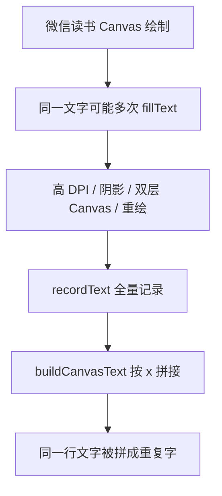

# Canvas 重复字与内容交错问题分析

## 现象

复制结果中出现：

- `第第11章章`
- `语语言言`
- `我我语语言言的的边边界界`
- 两条不同段落内容交错在同一个提取结果里

这说明当前结果仍来自 `canvas-hook`，并且 Canvas 捕获层把重复绘制和不同绘制流混进了输出。

## 可能根因



当前 `buildCanvasText()` 只在最终整行文本级别去重。如果同一行中每个文本片段被重复绘制两次，输出前的拼接就会变成：

```text
语 + 语 + 言 + 言 = 语语言言
```

整行去重无法修复这种“片段内重复”。

## 修复方向

- 在行内合并 `parts` 时，先按坐标和文本做片段级去重。
- 对同一 batch、同一 y 附近、同一 x 附近、同一文本，只保留一个片段。
- 保持跨屏累积逻辑，不恢复大面积清屏直接清空。

## TODO List

- [ ] 增加失败测试：同一批次同一坐标重复绘制单字时，输出不应变成重复字。
- [ ] 修改 `canvas-hook.js` 的 `buildCanvasText()`。
- [ ] 同步更新 `tests/content/canvas-accumulation.test.js` 的模拟逻辑。
- [ ] 运行 `node tests/content/canvas-accumulation.test.js` 和 `pytest -q`。

## 边界情况

- 真实相邻重复字不能被误删，例如“人人都”不能变成“人都”。
- 去重只能针对坐标近似相同的重复片段。
- 不同批次相同文本仍要允许存在，因为可能是滚动重叠或章节中重复句子。
