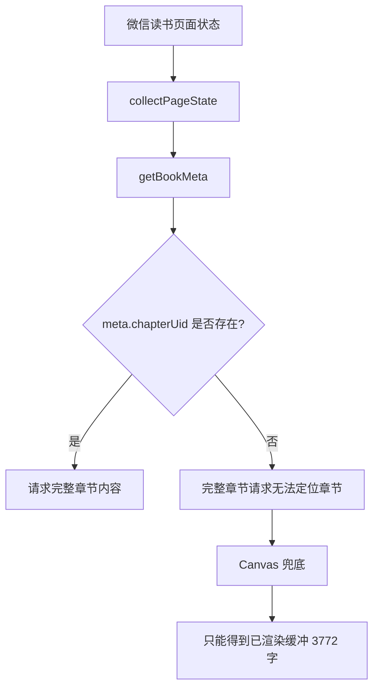

# 章节 UID 缺失导致长章节只能走 Canvas 的根因分析

## 真实日志结论

用户在长章节页面得到的调试日志：

```text
[debug]:{"event":"extract-start","bookId":"424018","chapterUid":"","chapterTitle":"第1章 语言，人类文明形成的关键因素","isCanvasMode":true}
[debug]:{"event":"full-chapter-bridge-empty","success":false,"error":"未在页面阅读器实例或章节接口响应中找到完整章节内容。"}
[debug]:{"event":"canvas-bridge-response","ok":true,"chars":3772,"count":3649}
[debug]:{"event":"extract-complete","method":"canvas-hook","rawChars":3772,"formattedChars":3830,"wordCount":3661}
```

这说明完整章节失败的第一根因是 `chapterUid` 为空。`bookId` 已经存在，但没有章节 UID，`canvas-hook.js` 的主动请求路径无法构造：

```text
/web/book/chapterContent?bookId=424018&chapterUid=<缺失>
```

因此系统只能退回 Canvas，最终得到 3772 字。

## 数据流



## 当前做错了什么

- `getBookMeta()` 只直接读取 `state.currentChapter.chapterUid` 或 `state.reader.chapterUid`。
- 当当前章节只有标题、目录 `chapterInfos` 里有 UID 时，没有通过标题或章节序号反查。
- 结果是日志里已经有 `chapterTitle`，但没有利用它补全章节身份。

## 修复方向

在 `src/content/extractor.js` 的元数据阶段补一个保守解析：

- 如果 `meta.chapterUid` 为空且 `state.chapterInfos` 存在：
  - 优先用 `chapterIndex/chapterIdx` 匹配目录。
  - 再用完全相等的 `chapterTitle` 匹配目录。
  - 匹配唯一时填充 `chapterUid` 和缺失的标题。
- 不做模糊匹配，避免误取同名章节。

## TODO List

- [ ] 增加 BDD 测试：Given 当前章节只有标题、目录有 UID，When 获取 meta，Then 自动补全 `chapterUid`。
- [ ] 运行测试，确认测试先失败。
- [ ] 修改 `extractor.js`，在 `getBookMeta()` 中从目录反查章节 UID。
- [ ] 运行 `pytest -q` 和 `node --check src/content/extractor.js`。
- [ ] 真实页面重新观察 `[debug]:extract-start`，确认 `chapterUid` 不再为空。

## 边界情况

- 目录中标题重复时不要通过标题补 UID。
- `chapterIdx` 为 `0` 时必须正常匹配，不能被假值判断跳过。
- 当前章节标题来自 DOM 兜底时，也应尝试目录反查。
- 反查失败时仍保持 Canvas 兜底，不能阻断提取。
