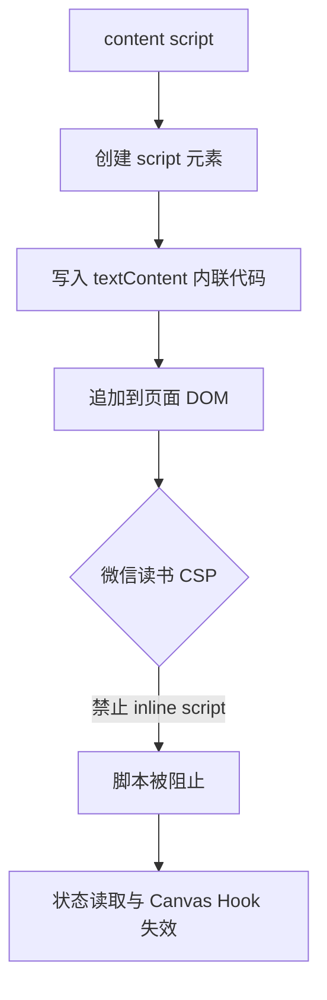
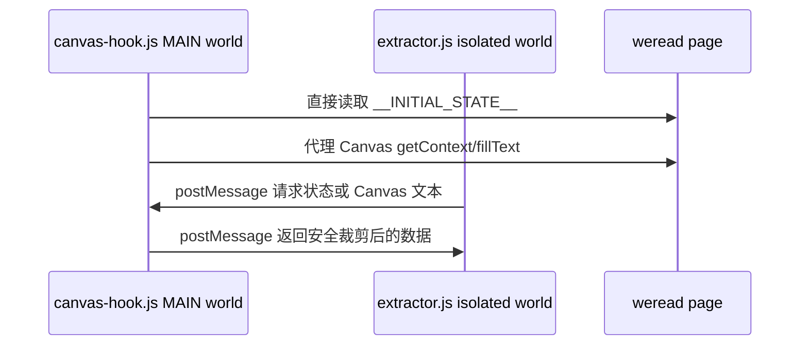

# CSP 内联脚本报错分析

## 现象

浏览器控制台提示 `Executing inline script violates the following Content Security Policy directive`，并阻止扩展执行内联脚本。偶发的 `Extension context invalidated` 通常来自扩展重新加载后旧 content script 仍在页面中运行。

## 根因

当前插件有两个页面上下文访问需求：

- 读取 `window.__INITIAL_STATE__` 获取书籍元信息。
- 在 Canvas 渲染模式下拦截 `CanvasRenderingContext2D.fillText`。

这两个能力都需要进入页面的 main world，但当前实现通过创建 `<script>` 并设置 `script.textContent` 注入内联代码。微信读书页面的 CSP 禁止内联脚本，因此脚本没有执行。

## 修复方向

改为使用 Chrome Manifest V3 的 content script `world: "MAIN"`，让 `src/content/canvas-hook.js` 作为扩展文件直接运行在页面 main world，避免内联脚本。隔离世界中的 `extractor.js` 不直接访问页面变量，而是通过 `window.postMessage` 请求数据。

## TODO

- 在 `manifest.json` 中将 `src/content/canvas-hook.js` 标记为 `world: "MAIN"`。
- 重写 `canvas-hook.js`，移除 `script.textContent` 注入。
- 重写 `extractor.js` 的页面状态与 Canvas 文本请求逻辑，统一走 `postMessage`。
- 增加 Pytest 静态回归测试，防止再次引入内联脚本注入。
- 手动重载扩展并验证控制台不再出现 CSP inline script 报错。
