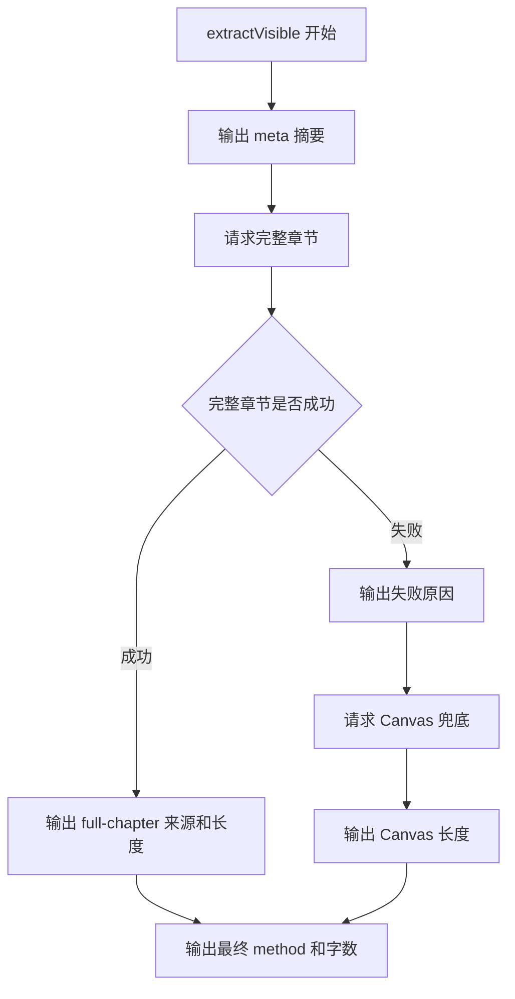

# 控制台调试输出实施规划

## 目标

为长章节提取链路增加控制台调试信息，统一格式为 `[debug]:xxx`，便于通过 Chrome DevTools MCP 的 console message 能力采集真实页面证据。

## 输出范围

## 代码结构规划

- `src/content/extractor.js`
  - 新增 `_debug(message, data)`。
  - 在 `extractVisible()` 中输出 meta、完整章节结果、Canvas 兜底结果、最终结果。
  - 在 `_extractFullChapterContent()` 中输出桥接响应失败或异常。
  - 在 `_extractFromCanvas()` 中输出 Canvas 返回长度。

## TODO List

- [ ] 增加测试，确认调试输出统一使用 `[debug]:` 前缀。
- [ ] 运行测试，确认新增测试在当前代码下失败。
- [ ] 实现 `_debug()` 和关键链路日志。
- [ ] 运行 Pytest，确认测试通过。
- [ ] 不修改当前已有未提交改动的 `src/content/canvas-hook.js`。

## 边界情况

- 调试日志不能输出章节正文，避免控制台泄露长文本。
- `console` 不存在或 `console.log` 不可用时，不能影响提取。
- 日志序列化失败时，不能影响提取。
