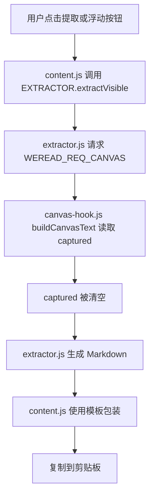
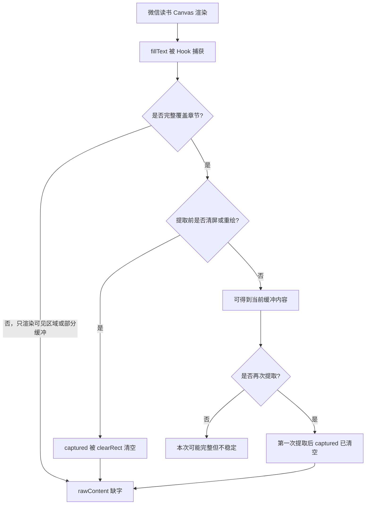
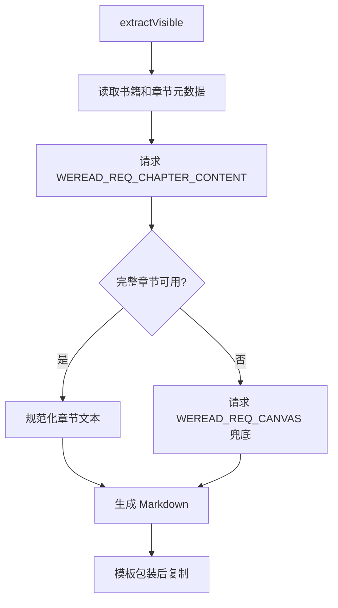

# 完整章节提取修复分析

## 问题描述

当前复制到剪贴板的真实文章内容来自 `extractVisible()` 返回的 `content`，再由模板系统包装成最终 prompt。预览区域只截断展示，不参与真实复制内容生成，因此本次修复不调整预览区域。

用户观察到“有时候并不会提取到全部文字”，根因是当前 `rawContent` 的来源只有 Canvas Hook 的临时捕获缓冲。Canvas 缓冲不是章节原文数据源，它只记录页面最近绘制过的 `fillText()` 文本，并且会在提取、大面积清屏、章节切换时被清空。

## 当前链路

## 丢字原因

## 修复方向

真实文章内容必须优先来自完整章节数据，而不是 Canvas 临时绘制日志。Canvas Hook 仍然保留，但只作为完整章节失败时的兜底。

## 代码结构规划

- `src/content/extractor.js`
  - 新增完整章节主路径 `_extractFullChapterContent(meta)`。
  - `extractVisible()` 优先使用完整章节，失败后回退 Canvas。
  - 返回 `method` 字段，区分 `full-chapter` 和 `canvas-hook`。
  - 保留已有 `buildPrompt()`，不恢复旧的内置 prompt 构建。

- `src/content/canvas-hook.js`
  - 增加 `WEREAD_REQ_CHAPTER_CONTENT` 消息处理。
  - 从页面状态、阅读器实例、章节接口响应缓存、主动 fetch 中寻找完整章节。
  - 保留 Canvas `fillText()` 捕获逻辑作为兜底。

- `tests/content/`
  - 增加 BDD 风格 Pytest，验证真实内容主路径优先完整章节。
  - 验证完整章节失败时仍保留 Canvas 兜底。
  - 验证复制链路依旧通过模板 `{{content}}` 包装完整 Markdown。

## TODO List

- [ ] 编写失败测试，锁定完整章节优先级和 Canvas 兜底行为。
- [ ] 运行 Pytest，确认新增测试在当前代码下失败。
- [ ] 修改 `extractor.js`，让 `extractVisible()` 优先请求完整章节内容。
- [ ] 修改 `canvas-hook.js`，实现完整章节内容响应。
- [ ] 运行 Pytest，确认测试通过。
- [ ] 复核真实复制链路，确认预览区域没有被改动。

## 边界情况

- 当前页面拿不到 `bookId` 或 `chapterUid` 时，不能阻断 Canvas 兜底。
- 章节接口返回 HTML、纯文本、对象嵌套、数组段落时，需要统一规范化。
- 页面阅读器实例结构可能变化，因此完整章节提取需要多候选源选择。
- 连续点击提取时，完整章节主路径不能依赖 Canvas 缓冲是否已被清空。
- 模板系统已经从 `copyContent` 改为运行时 `buildPrompt()`，修复不能破坏该链路。
