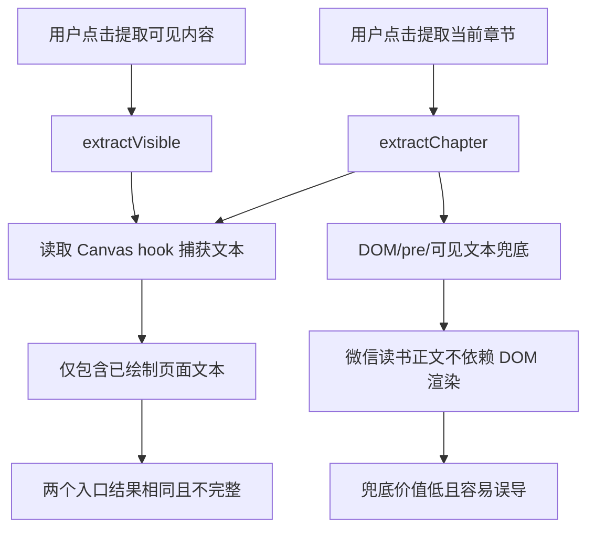
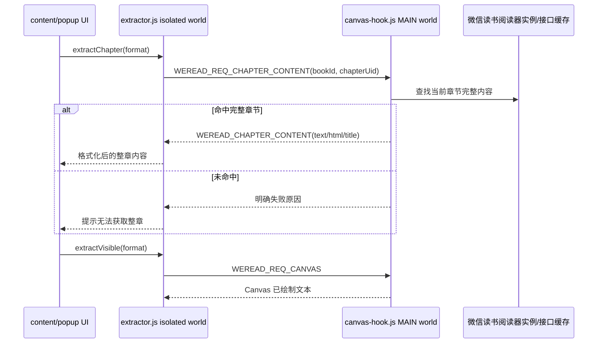

# 整章内容获取分析

## 现象

当前“提取当前章节”和“提取可见内容”经常得到相同结果，并且复制出来的内容不完整。原因不是按钮绑定错误，而是两个入口最终都会读取 Canvas 已绘制文本；这批文本只代表当前页面已经渲染过的内容，不代表整章全文。

## 根因

微信读书阅读页以 Canvas 为主渲染正文，正文不会稳定存在于 DOM 中。现有章节提取流程把 DOM、`pre`、可见文本作为兜底策略，但这些策略对当前渲染方式没有可靠价值；当 Canvas hook 能返回内容时，章节提取和可见提取会读取同一份已绘制文本。

## 修复方向

把“整章”和“可见”拆成两个数据来源：

- 整章内容：在 main world 中读取微信读书页面内部阅读器实例或章节接口返回的数据，优先使用 `chapterContentForEPub` 这类完整章节字段，并通过 `postMessage` 返回给 isolated world。
- 可见内容：继续使用 Canvas hook 返回当前已绘制内容，只表达“当前屏幕/已绘制页面”。
- 章节入口不再使用 DOM 正文兜底；拿不到完整章节数据时明确失败并提示原因。

## 代码结构规划

- `src/content/canvas-hook.js`
  - 保留 Canvas `fillText` 捕获能力，用于可见内容。
  - 增加阅读器实例查找、章节 UID 判断、完整章节字段读取。
  - 增加 fetch/XMLHttpRequest 响应缓存，作为内部实例字段缺失时的补充来源。
  - 增加 `WEREAD_REQ_CHAPTER_CONTENT` 消息处理。

- `src/content/extractor.js`
  - `extractChapter` 只请求完整章节内容，不再调用 DOM/pre/可见文本兜底。
  - `extractVisible` 只处理选区和 Canvas 已绘制文本。
  - 增加 HTML 章节片段转纯文本的解析逻辑。

- `tests/content/test_full_chapter_extraction.py`
  - 用 Pytest 静态测试锁定章节入口不再走 DOM 兜底。
  - 锁定 main world bridge 提供完整章节消息接口与阅读器/接口缓存策略。

## TODO

- [ ] 编写回归测试，确认章节提取使用 `WEREAD_REQ_CHAPTER_CONTENT`。
- [ ] 运行测试，确认当前实现失败。
- [ ] 修改 `canvas-hook.js`，提供完整章节 bridge。
- [ ] 修改 `extractor.js`，移除章节正文 DOM 兜底。
- [ ] 运行 Pytest，确认全部通过。
- [ ] 做代码审查，确认整章和可见内容边界清晰。
