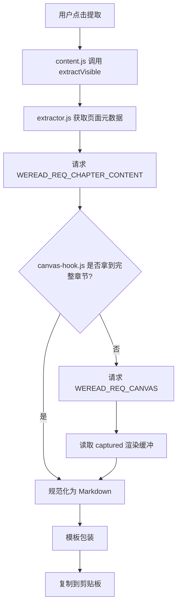
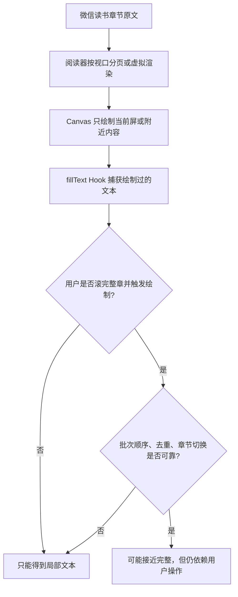
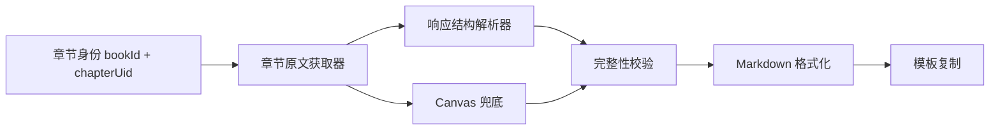

# 长章节提取失败根因分析与修复规划

## 结论

当前插件没有真正稳定实现“整个章节内容提取”。代码已经把 `extractVisible()` 设计成“完整章节优先，Canvas 兜底”，但真实页面里完整章节路径很可能没有拿到有效数据，于是运行时退回 Canvas 渲染缓冲。3000 多字符不是剪贴板限制，也不是预览截断，而是当前页面已经绘制、已经被 Hook 捕获的可见区域附近文本规模。

从第一性原理看，文本提取只有两类数据源：

- 原文数据源：接口响应、阅读器状态、章节内容对象。它天然能表示整章。
- 渲染副作用：Canvas `fillText()` 调用日志。它只能表示浏览器为了当前视口绘制过什么。

如果目标是“整章”，主路径必须是原文数据源。Canvas 只能兜底，不能作为完整性保证。

## 当前实际链路

真实体验只有 3000 多字符，说明大概率走到了 `G -> H`。也就是“完整章节主路径失败，Canvas 兜底成功”。

## 为什么 Canvas 路径天然不适合整章

Canvas 缓冲的本质是“观察到的绘制记录”，不是章节内容模型。长章节越长，越依赖滚动、重绘、批次合并和去重，失败面越大。这个方向可以改善，但不能从根上保证整章。

## 当前做对了什么

- `src/content/extractor.js:95` 到 `src/content/extractor.js:109` 已经建立了正确优先级：先请求完整章节，失败后才使用 Canvas。
- `src/content/canvas-hook.js:316` 到 `src/content/canvas-hook.js:325` 已经尝试三类完整章节来源：阅读器实例、网络响应缓存、主动 fetch。
- `src/content/canvas-hook.js:290` 到 `src/content/canvas-hook.js:313` 已经有网络响应缓存，方向正确。
- `src/content/canvas-hook.js:520` 到 `src/content/canvas-hook.js:687` 已经实现候选内容递归扫描和评分，比硬编码一个字段更抗页面结构变化。
- `tests/content/test_full_chapter_extraction.py` 覆盖了“完整章节优先”和“失败回退 Canvas”的控制流。
- 当前未跟踪到复制或预览截断导致真实内容丢失。`popup.js` 的 800 字截断只是预览，不影响复制内容。

## 当前做错了什么

### 1. 测试证明的是“设计意图”，不是“真实页面可用”

`tests/content/test_full_chapter_extraction.py:76` 到 `tests/content/test_full_chapter_extraction.py:129` 通过 mock 强行让 `_extractFullChapterContent()` 成功或失败。它没有验证 `canvas-hook.js` 能从真实响应结构里解析出整章。

`tests/content/test_full_chapter_extraction.py:132` 到 `tests/content/test_full_chapter_extraction.py:138` 只检查字符串存在，没有执行 `getFullChapterContent()` 的解析逻辑。

结果是测试全绿，但用户仍然只能拿到 Canvas 缓冲。

### 2. 完整章节路径缺少可观测性

当前 `extractVisible()` 返回 `method`，但用户点击 FAB 时只看到 `已复制 X 字`。如果完整章节失败后回退 Canvas，用户无法知道失败原因。工程上也没有记录：

- `bookId` 和 `chapterUid` 是否为空。
- 走了 reader、cache、fetch 哪个来源。
- 主动 fetch 的 URL 是否 401、403、404 或返回非预期结构。
- 候选内容被丢弃的原因，是长度过短、章节 ID 不匹配，还是字段不在扫描白名单里。

没有观测点，就只能从“3000 多字符”倒推。排障成本高。

### 3. 主动 fetch 可能缺少微信读书接口所需上下文

`src/content/canvas-hook.js:480` 到 `src/content/canvas-hook.js:505` 只尝试了三个 URL，并只带 `credentials` 和 `Accept`。如果微信读书接口依赖 `synckey`、`bookVersion`、`pf`、`platform`、`base64` 组合、referer 语义、加密字段或动态接口路径，这条路径会安静失败。

这解释了为什么真实页面可能一直退回 Canvas。

### 4. Vue/React 实例扫描是启发式，不是契约

`findReaderVm()` 通过全局变量、选择器、Vue 私有字段扫描阅读器实例。这种方式对页面版本很敏感。微信读书如果改了 class、框架挂载结构、字段名或把正文放到更深对象里，`isReaderVm()` 可能找到“像阅读器但没有正文”的对象。

这是正确方向，但还不够硬。

### 5. Canvas 累积修复不能替代整章修复

当前工作区里 `src/content/canvas-hook.js` 有未提交改动，看起来是在让 Canvas 跨清屏累积批次，而不是清空 captured。这能提升“滚动后多抓一点”的体验，但本质还是依赖用户让整章被绘制。它不是整章提取的根因修复。

## 本质问题

本质不是“字符上限太小”，而是“插件把整章这个数据问题，退化成了渲染观察问题”。

正确抽象应该是：

其中 `D[完整性校验]` 是当前缺失的关键。没有校验时，Canvas 返回 3000 字也会被当成成功。

## 建议修复规划

### 阶段 1：先加诊断，不改提取策略

- 在 `extractVisible()` 的结果中扩展 `debug` 字段，记录完整章节路径的来源、失败原因、候选数量、最终 method。
- FAB 和 Popup 提示区显示 `method`，例如 `完整章节` 或 `Canvas 兜底`。
- 对 Canvas 兜底增加明确提示：这不是整章保证。

验收标准：用户再次复现时，可以直接知道是 `full-chapter` 成功还是 `canvas-hook` 兜底。

### 阶段 2：给完整章节解析器补真实结构测试

- 为 `canvas-hook.js` 的章节解析逻辑抽出可测试单元，或在测试里加载 hook 并暴露测试入口。
- 增加 BDD 用例：
  - Given 接口返回 `{ data: { chapterContent: base64Html } }`，Then 输出整章文本。
  - Given 接口返回 `{ data: { content: [...] } }`，Then 合并段落。
  - Given chapterUid 在嵌套对象中，Then 不误判其他章节。
  - Given 响应字段不在白名单中，Then 记录候选扫描失败。

验收标准：测试不再只是检查桥存在，而是执行解析器。

### 阶段 3：用真实页面网络响应校准字段

- 在真实微信读书页面记录被 `isPotentialChapterUrl()` 捕获的 URL、状态和响应结构摘要。
- 不保存正文，只保存字段路径、长度、chapterUid、是否 base64、是否 HTML。
- 根据真实结构调整 `collectContentCandidates()` 的字段白名单和解码策略。

验收标准：能证明 `WEREAD_REQ_CHAPTER_CONTENT` 在真实页面返回 `source: network:*` 或 `source: reader.*`。

### 阶段 4：加入完整性判定

- 如果完整章节路径失败，不要把 Canvas 兜底静默伪装成正常整章。
- 对长章节建立最低可信规则：
  - 完整章节来源为 `reader.*` 或 `network:*` 才标记为完整。
  - Canvas 来源标记为部分内容。
  - 如果章节目录或阅读进度能提供长度估计，低于阈值时提示用户。

验收标准：不会再出现“只复制 3000 多字但 UI 看起来像成功整章”的误导。

## TODO List

- [ ] 编写失败测试：真实执行章节 payload 解析，而不是 mock `_extractFullChapterContent()`。
- [ ] 编写失败测试：完整章节失败时返回可观测 debug 信息。
- [ ] 编写失败测试：Canvas 兜底结果必须标记为 partial。
- [ ] 增加真实页面诊断开关，不记录正文，只记录结构摘要。
- [ ] 根据真实微信读书响应结构修正字段扫描、base64 解码和主动 fetch 参数。
- [ ] 在 FAB 和 Popup 中显示提取来源与完整性状态。

## 边界情况

- `bookId` 或 `chapterUid` 为空时，完整章节路径应快速失败并说明原因。
- 主动 fetch 返回登录失效、权限不足或购买限制时，不能吞掉错误。
- 网络响应可能是 base64、HTML、纯文本、数组段落或深层对象。
- 当前章节和缓存章节不一致时，不能误用上一章内容。
- Canvas 兜底可能因为用户没有滚动完整章而只得到局部内容。
- 长章节响应可能超过当前缓存长度限制，需要记录被跳过而不是静默忽略。

## NOT in scope

- 不重写 UI 视觉设计，本次只规划诊断与提取可靠性。
- 不移除 Canvas Hook，它仍然是必要兜底。
- 不实现跨章节批量导出，本次只解决当前章节完整提取。
- 不绕过微信读书权限或付费限制，只使用当前登录用户页面可访问的数据。

## What already exists

- 完整章节优先入口已存在，应该复用。
- Canvas Hook 兜底已存在，应该保留但降级为 partial。
- 网络响应缓存已存在，应该增强观测和真实结构覆盖。
- Markdown 和模板包装已存在，不需要重建。

## 测试计划

- `pytest -q`
- `node tests/content/canvas-accumulation.test.js`
- 新增针对章节 payload 解析的 Pytest BDD 测试。
- 新增针对 UI 来源提示的静态或消息链路测试。

## 并行化策略

Sequential implementation, no parallelization opportunity.

主要改动都会围绕 `src/content/` 的提取链路和 `tests/content/` 的对应测试展开，顺序推进更安全。

## 工程评审摘要

- Architecture Review: 2 issues found，完整章节路径缺可观测性，Canvas 兜底被当作成功结果。
- Code Quality Review: 1 issue found，真实解析逻辑难以测试。
- Test Review: 3 gaps identified，缺真实 payload、失败原因、partial 状态测试。
- Performance Review: 1 issue found，Vue 全 DOM 扫描和候选递归需要诊断边界，但当前不是 3000 字根因。
- Failure modes: 1 critical gap，完整章节失败且 Canvas 兜底成功时，用户看到成功但实际是局部内容。
- Lake Score: 8/10，完整修复是可控湖泊，不是重写海洋。
