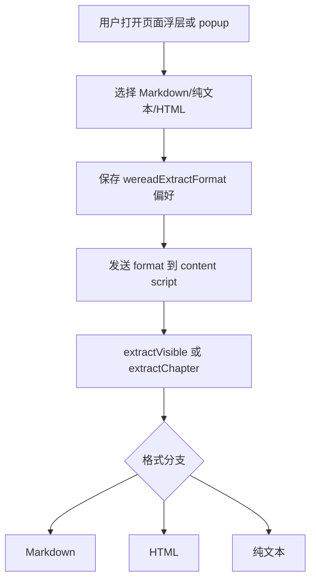

# 仅保留 Markdown 输出分析

## 背景

当前插件支持 Markdown、纯文本、HTML 三种输出格式，并在页面浮层和 popup 中展示格式选择行。实际使用中，微信读书内容提取的核心价值是拿到可复制、可读、结构稳定的文本；继续保留多格式选择会增加 UI 噪音，也让提取逻辑维护三套输出路径。

本次调整目标是：插件只输出 Markdown，移除所有用户可见的格式选择行，并删除 HTML 与纯文本格式化支持。

## 当前流程

问题点：

- UI 上的格式选择行占用空间，但现在只需要 Markdown。
- popup 和页面浮层都维护格式按钮事件，重复且不再必要。
- `extractor.js` 暴露 `_toHTML` 与 `_toPlainText`，让外部消息传入 `html` 或 `text` 后仍能得到非 Markdown 输出。
- `background/service-worker.js` 仍初始化格式偏好，容易让旧状态继续影响新逻辑。

## 目标流程

## 代码结构规划

- `src/content/content.js`
  - 移除格式配置、storage 读取、格式按钮事件、重新格式化函数。
  - 调用提取时不传入格式参数。
  - 处理旧消息时忽略 `msg.format`，始终输出 Markdown。

- `src/popup/popup.html`
  - 删除 `.format-group` 整段。

- `src/popup/popup.js`
  - 删除 `selectedFormat`、格式偏好读取、格式按钮绑定、`reformat`。
  - 发送消息时不携带 `format`。

- `src/content/extractor.js`
  - `extractChapter` 和 `extractVisible` 不再接收格式参数。
  - 统一调用 `_toMarkdown`。
  - 删除 `_format`、`_toHTML`、`_toPlainText`。

- `src/background/service-worker.js`
  - 删除 `wereadExtractFormat` 默认值。

- `manifest.json`
  - 更新扩展描述，避免继续宣称支持纯文本和 HTML 输出。

- `tests/content/`
  - 增加 Markdown-only 静态测试，覆盖 UI、消息参数、extractor 格式分支。

## TODO List

- [ ] 编写失败测试，要求 UI 不出现格式选择和非 Markdown 选项。
- [ ] 编写失败测试，要求 popup/content 消息不传递 `format`。
- [ ] 编写失败测试，要求 extractor 不再包含 HTML/纯文本格式化分支。
- [ ] 运行 Pytest，确认测试在当前实现下失败。
- [ ] 修改页面浮层。
- [ ] 修改 popup HTML 与逻辑。
- [ ] 修改 extractor 输出路径。
- [ ] 修改后台默认配置。
- [ ] 修改 manifest 描述。
- [ ] 运行 Pytest，确认全部通过。

## 边界情况

- 旧调用传入 `format: 'html'` 或 `format: 'text'` 时，content script 会忽略该字段，extractor 仍输出 Markdown。
- 已存在的 `wereadExtractFormat` storage 值不再读取，因此不会影响输出。
- 章节接口返回 HTML 片段时，仍会先转为普通正文，再包成 Markdown 输出；这属于输入归一化，不是 HTML 输出支持。
