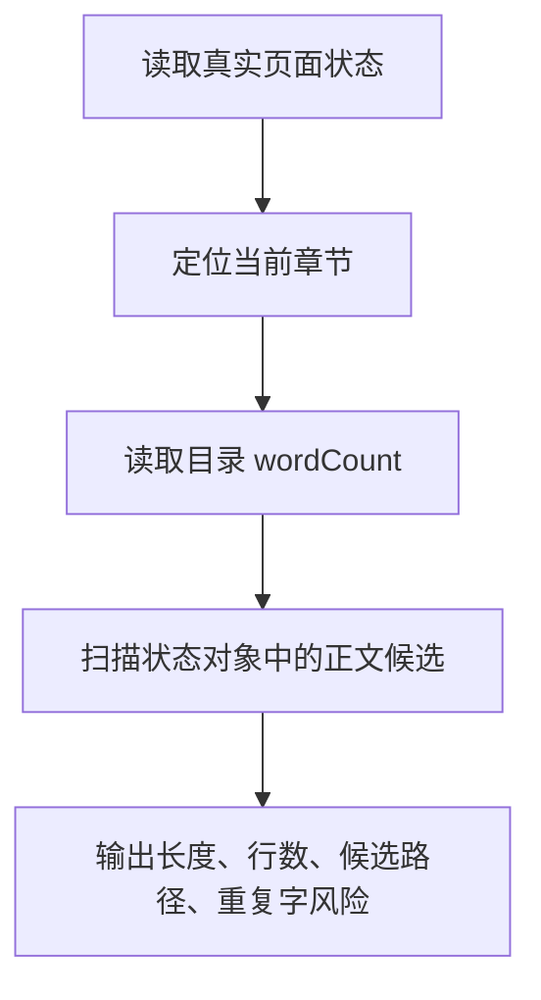

# 只输出字数的自动化验证规划

## 目标

增强 `tools/weread-verify.mjs`，增加只输出质量指标的模式，用于验证真实页面是否能拿到章节结构和候选正文长度，但不输出章节正文。

## 输出范围

## 安全边界

- 不输出正文。
- 不输出 Cookie。
- 不输出完整 HTML。
- 只输出长度、字段路径、状态码、章节元数据。

## TODO List

- [ ] 增加 `--quality-only` 参数。
- [ ] 自动选择当前章节，不必手动传 `--chapter-uid`。
- [ ] 输出 `expectedWordCount`、`candidateCount`、最大候选长度、候选路径。
- [ ] 运行 `node --check tools/weread-verify.mjs`。
- [ ] 运行 `node tools/weread-verify.mjs --quality-only`。

## 限制

命令行 verifier 只能读取 HTML 和接口响应，不能执行真实浏览器中的 Canvas 绘制 Hook。因此它不能直接统计插件 Canvas 实际复制字数；Canvas 实际字数仍以插件控制台 `[debug]:extract-complete` 为准。
