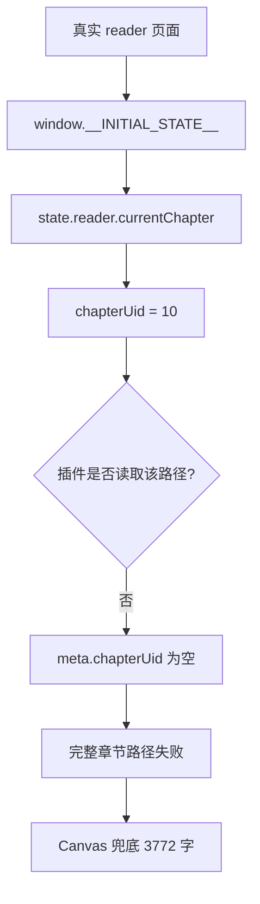

# reader.currentChapter 状态路径漏读修复分析

## 自动验证结论

`tools/weread-verify.mjs` 使用真实 Cookie 访问长章节页面后，得到：

```text
currentChapter.title = 第1章 语言，人类文明形成的关键因素
currentChapter.chapterUid = 10
currentChapter.chapterIdx = 10
currentChapter.wordCount = 12127
chapterInfosCount = 28
```

关键点：这些字段位于 `window.__INITIAL_STATE__.reader.currentChapter`，而当前插件只优先读取：

- `state.currentChapter`
- `state.reader.chapterUid`

因此插件真实运行时 `chapterUid` 为空。

## 验证链路



## 章节接口探测结果

指定 `--chapter-uid 10` 后，当前三个 `chapterContent` URL 都返回 404：

- `/web/book/chapterContent?...`
- `/web/book/chapterContent?...&base64=1`
- `https://i.weread.qq.com/book/chapterContent?...`

这说明当前 URL 组合不是可用的完整章节接口。下一步应该先修正章节身份，再观察真实页面缓存或阅读器实例是否含正文。

## 修复方向

- `canvas-hook.js`
  - `collectPageState()` 应优先读取 `state.reader.currentChapter`。
  - `reader.chapterUid` 也应从 `reader.currentChapter.chapterUid` 兜底。

- `extractor.js`
  - `getBookMeta()` 应读取 `state.reader.currentChapter`。
  - `bookId` 应兼容 `state.reader.bookInfo.bookId`。

## TODO List

- [ ] 增加测试：`getBookMeta()` 能读取 `state.reader.currentChapter.chapterUid`。
- [ ] 修改 `extractor.js`。
- [ ] 修改 `canvas-hook.js`。
- [ ] 运行 `pytest -q`、`node --check` 和 verifier。
- [ ] 重新加载插件后确认 `[debug]:extract-start` 的 `chapterUid` 为 `10`。

## 边界情况

- `chapterUid` 可能是数字，需要转成字符串或保持可序列化值。
- `chapterIdx` 为 `0` 或 `10` 都不能被假值判断跳过。
- 如果 `state.reader.currentChapter` 和 `state.currentChapter` 同时存在，应优先使用 reader 当前章节。
