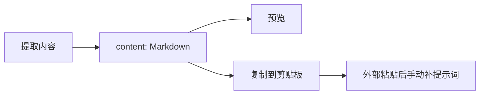
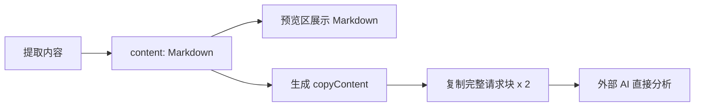
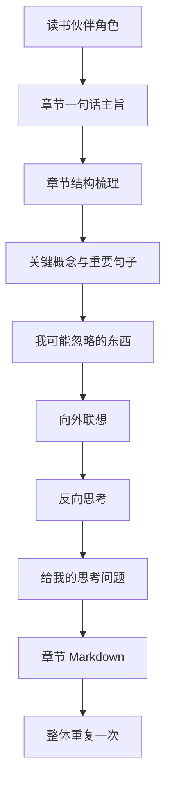

# 复制时自动拼接读书提示词分析

## 背景

用户复制章节内容后，下一步通常是粘贴到外部 AI 中，请 AI 帮忙梳理章节内容、发现被忽略的暗线，并产生跨领域联想。当前插件只复制提取后的 Markdown 内容，用户还需要手动补充提示词。

本次目标是：点击“复制到剪贴板”时，自动复制两份完全相同的“读书分析提示词 + Markdown 章节内容”完整请求块，让外部 AI 可以直接进入深度阅读任务。

## 设计原则

- 预览区继续展示干净的章节 Markdown，不把提示词混入阅读预览。
- 复制内容单独使用 `copyContent` 字段，避免 UI 展示和剪贴板内容互相耦合。
- 提示词要求 AI 区分原文依据、推测、类比，降低胡乱发挥的风险。
- 页面浮层和 popup 使用同一份 `copyContent`，保持一致体验。
- 剪贴板内容由两个完全相同的完整请求块组成：`提示词 + 原文`、`提示词 + 原文`。
- 第二个请求块不添加“提示词二”之类的差异标签，确保它和第一个请求块逐字一致。

## 当前流程

## 目标流程

## 提示词结构

## 代码结构规划

- `src/content/extractor.js`
  - 增加 `_buildReadingPrompt(markdownContent)`。
  - `extractChapter()` 和 `extractVisible()` 返回 `copyContent`。
  - `content` 保持原有 Markdown，用于预览。
  - `_buildReadingPrompt` 先构造 `singlePrompt`，再返回 `[singlePrompt, singlePrompt].join(...)`。

- `src/content/content.js`
  - 复制时使用 `lastResult.copyContent || lastResult.content`。
  - fallback 复制同样使用拼接后的文本。

- `src/popup/popup.js`
  - 复制时使用 `currentResult.copyContent || currentResult.content`。
  - fallback 复制同样使用拼接后的文本。

- `tests/content/`
  - 增加 Pytest 静态测试，保证提示词存在、结果包含 `copyContent`，且两个复制入口优先复制 `copyContent`。

## TODO List

- [ ] 编写失败测试，覆盖提示词生成和复制入口。
- [ ] 运行测试，确认当前实现失败。
- [ ] 修改 extractor 返回 `copyContent`。
- [ ] 将 `copyContent` 改成完整请求块整体重复两次。
- [ ] 修改页面浮层复制逻辑。
- [ ] 修改 popup 复制逻辑。
- [ ] 运行 Pytest，确认全部通过。

## 边界情况

- 如果历史结果没有 `copyContent`，复制逻辑回退到 `content`，避免旧数据导致复制失败。
- 提取失败时不会启用复制按钮，因此不需要生成提示词。
- 章节内容很长时，复制文本会约为原完整请求块的两倍；这是外部 AI 使用场景的预期行为。
