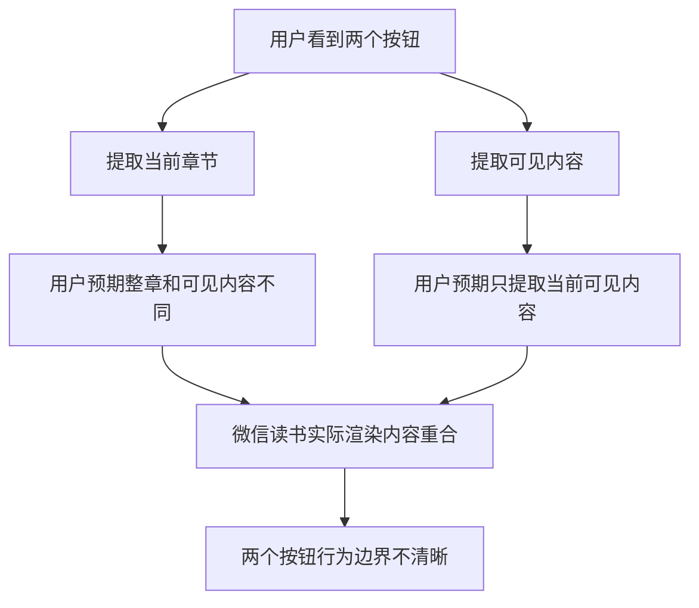
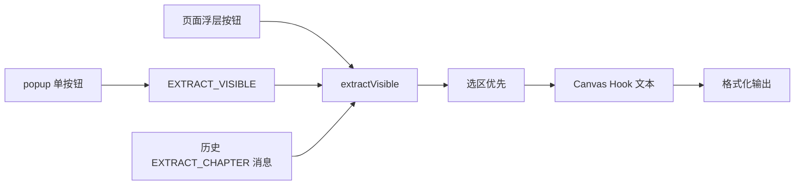

# 合并提取入口分析

## 背景

微信读书阅读页会把当前阅读上下文需要的内容一次性渲染到页面中。对于当前插件的用户体验来说，“提取当前章节”和“提取可见内容”在实际操作中得到的内容高度重合，继续暴露两个按钮会让用户误以为存在两套有效能力。

本次调整目标是：页面浮层和扩展 popup 都只保留一个提取入口，统一走可见内容提取逻辑。

## 当前问题

- UI 层制造了不必要的选择成本。
- popup 和页面浮层分别维护两套按钮状态与恢复文案，重复度较高。
- 历史消息 `EXTRACT_CHAPTER` 可以保留为兼容入口，但不再作为用户可见按钮。

## 目标结构

## 代码结构规划

- `src/content/content.js`
  - 页面浮层只渲染一个提取按钮。
  - 点击后调用 `EXTRACTOR.extractVisible(preferredFormat)`。
  - `EXTRACT_CHAPTER` 消息作为兼容入口转发到 `extractVisible`。

- `src/popup/popup.html`
  - 删除“提取当前章节”按钮。
  - 保留一个主按钮“提取可见内容”。

- `src/popup/popup.js`
  - 删除章节按钮引用与分支。
  - readiness 检测时只启用单个提取按钮。
  - 重新格式化时统一发送 `EXTRACT_VISIBLE`。

- `tests/content/`
  - 用 Pytest 静态校验页面浮层和 popup 都不再暴露“提取当前章节”按钮。
  - 校验历史 `EXTRACT_CHAPTER` 消息仍走 `extractVisible`，避免旧入口失效。

## TODO List

- [ ] 编写失败测试，覆盖单按钮 UI 和消息兼容行为。
- [ ] 运行 Pytest，确认测试在当前实现下失败。
- [ ] 修改页面浮层 UI 和事件绑定。
- [ ] 修改 popup HTML 与逻辑。
- [ ] 运行 Pytest，确认所有测试通过。
- [ ] 复核 diff，确保没有引入无关改动。

## 边界情况

- 用户已有选中文字时，仍然优先提取选区。
- 没有选区且 Canvas Hook 没有文本时，仍返回“当前页面无可提取内容”。
- 旧版本 popup 或外部调用如果发送 `EXTRACT_CHAPTER`，仍能获得可见内容提取结果。
- 格式切换后重新提取应保持当前单入口，不再回到章节分支。
