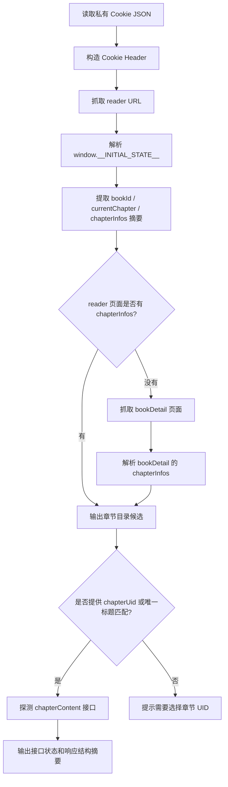

# 微信读书真实页面自动化验证环境规划

## 目标

构造一个不依赖插件 UI 的命令行验证环境，用真实微信读书 Cookie 访问页面，但只输出结构摘要，不输出 Cookie 和章节正文。

## 安全约束

- Cookie 只能从本机私有文件或环境变量读取。
- Cookie 文件不能提交到 Git。
- 输出中不打印 Cookie、完整正文、完整接口响应。
- 只输出字段路径、状态码、长度、候选章节信息和失败原因。

## 验证链路

## 代码结构规划

- `tools/weread-verify.mjs`
  - 读取 `--cookie-file`、`WEREAD_COOKIE_FILE` 或默认 `.secrets/weread-cookies.json`。
  - 读取 `--url` 或 Cookie JSON 中的 `sourceUrl`。
  - 解析 `window.__INITIAL_STATE__`。
  - 汇总 `bookId`、`chapterInfos`、当前章节状态。
  - 可选参数 `--chapter-uid` 用来探测完整章节接口。
  - 可选参数 `--chapter-title` 用来唯一匹配目录标题。

- `.gitignore`
  - 增加 `.secrets/`，避免误提交 Cookie。

## TODO List

- [ ] 更新 `.gitignore`，忽略本机私有 Cookie 目录。
- [ ] 新增 `tools/weread-verify.mjs`。
- [ ] 运行 `node --check tools/weread-verify.mjs`。
- [ ] 在文档或最终回复中说明如何保存 Cookie 和运行脚本。

## 边界情况

- reader 页面没有 `__INITIAL_STATE__`。
- reader 页面有 `bookId` 但没有 `chapterInfos`。
- bookDetail 页面需要登录或返回异常。
- 章节标题是小节标题，无法唯一匹配目录。
- `chapterContent` 接口返回非 JSON、鉴权失败或空候选。
